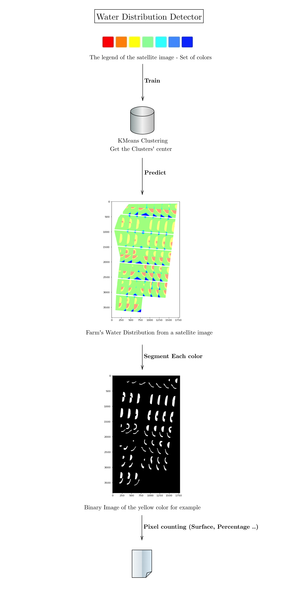

# Water Disribution Detector
In agriculture, it is crucial to have an uniform irrigation (water distribution over the farm) in order to maximize the farm's rendering. In this project, I prpose a novel method to evaluate a farm water distribution from satellite images and then calculate automatically the uniformity coefficient.

# Main Approach

# Results 

# How to use it ? 

1- Download the notebook.
2- Upload it in google colab.
3- Upload a legend image (name it colors.png) and your original images. 
4- Enjoy your Excel file with the approximate surface of each color. 
